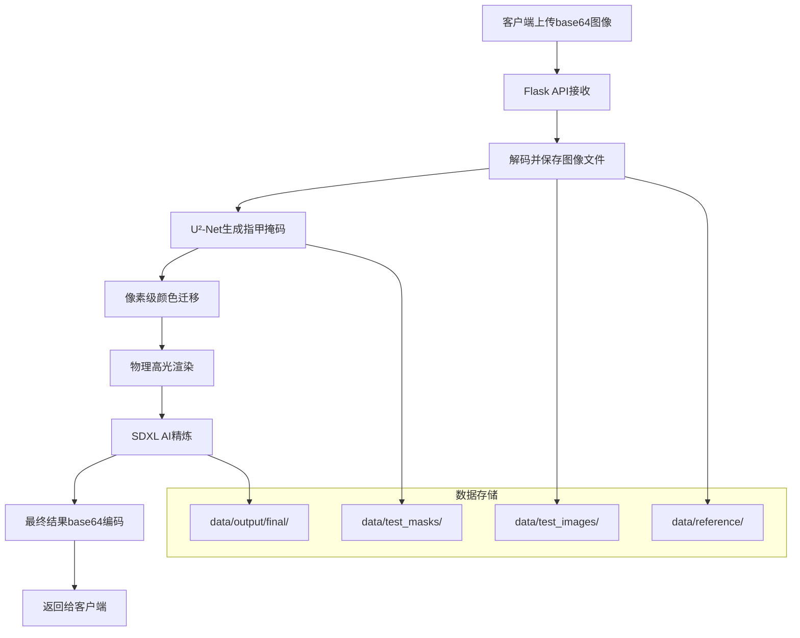

# 🎨 美甲虚拟试戴系统 - API流程详细文档

## 📖 项目概述

这是一个基于AI的美甲虚拟试戴系统，集成了深度学习分割、图像处理、AI生成和Web服务等多个技术模块。系统能够自动识别指甲区域，应用不同颜色效果，并生成逼真的美甲预览图。

## 🏗️ 系统架构

### 核心技术栈
- **深度学习**: PyTorch + U²-Net + Stable Diffusion XL
- **图像处理**: OpenCV + PIL + 物理光照模型  
- **Web服务**: Flask + 异步处理
- **算法优化**: Active Contour + Lab颜色空间 + Phong渲染

## 🔄 完整API调用流程

### 1. 服务启动与初始化

```python
# editor_image_server.py - 服务入口
app = Flask(__name__)

# 初始化核心处理器
nail = NailSDXLInpaintOpenCV()  # AI增强处理器
masker = U2NetMasker()          # 指甲分割器

# 配置参数
app.config['MAX_CONTENT_LENGTH'] = 100 * 1024 * 1024  # 100MB
app.config['MAX_FORM_MEMORY_SIZE'] = 50 * 1024 * 1024  # 50MB
```

**功能说明：**
- 初始化Flask Web服务
- 加载U²-Net指甲分割模型
- 预加载SDXL AI生成模型
- 配置文件上传限制

### 2. API接口定义

#### POST `/edit_nail` - 美甲生成接口

**请求参数：**
```json
{
  "img": "base64编码的原始手部图片（不含前缀）",
  "ref_img": "base64编码的参考色块图片（不含前缀）"
}
```

**返回结果：**
```json
{
  "statusCode": 200,
  "message": "生成完成",
  "task_id": "143022123",
  "data": "data:image/png;base64,iVBORw0KGgoAAAANS..."
}
```

### 3. 核心处理流水线

#### 阶段1: 图像预处理
```python
# 1. 解码base64图像
img_data = base64.b64decode(img_b64)
ref_data = base64.b64decode(ref_b64)

# 2. 转换为OpenCV格式
img = cv2.imdecode(np.frombuffer(img_data, np.uint8), cv2.IMREAD_COLOR)
ref_img = cv2.imdecode(np.frombuffer(ref_data, np.uint8), cv2.IMREAD_COLOR)

# 3. 生成唯一任务ID
task_id = time.strftime("%H%M%S") + str(int(time.time() * 1000) % 1000).zfill(3)

# 4. 保存输入文件
img_path = f"data/test_images/{task_id}.jpg"
ref_path = f"data/reference/{task_id}_reference.jpg"
mask_path = f"data/test_masks/{task_id}_mask_input_mask.png"
```

**功能说明：**
- 解码客户端上传的base64图像
- 生成基于时间戳的唯一任务ID
- 建立标准化的文件存储结构

#### 阶段2: U²-Net指甲分割
```python
# U2NetMasker.get_mask() 调用流程
def get_mask(self, image: np.ndarray, image_path: str, disable_cache: bool = False):
    # 1. 预处理图像
    img = cv2.cvtColor(image, cv2.COLOR_BGR2RGB)
    pil_img = Image.fromarray(img).resize(IMG_SIZE)
    arr = np.array(pil_img).astype(np.float32) / 255.0
    
    # 2. U²-Net模型推理
    tensor = torch.from_numpy(arr.transpose((2, 0, 1))).unsqueeze(0).float().to(self.device)
    with torch.no_grad():
        d0, *_ = self.model(tensor)
        pred = torch.sigmoid(d0)
    
    # 3. 后处理生成软掩码
    mask = pred.squeeze().cpu().numpy()
    mask = (mask * 255).astype(np.uint8)
    mask = cv2.resize(mask, (image.shape[1], image.shape[0]), interpolation=cv2.INTER_LINEAR)
    mask = cv2.GaussianBlur(mask, (3, 3), 0)  # 边缘羽化
    
    # 4. 背景清理
    background_threshold = 10
    mask[mask < background_threshold] = 0
    
    return mask
```

**功能说明：**
- 使用U²-Net深度学习模型进行指甲区域分割
- 生成0-255灰度软掩码，支持边缘羽化
- 自动清理背景噪声
- 智能缓存机制优化性能

#### 阶段3: 完整处理流水线
```python
# run_full_pipeline() 三阶段处理
def run_full_pipeline(img_path, ref_path, mask_path, task_id=None):
    # 子阶段3.1: 像素级颜色迁移
    transplanted_img_path = process_one_pixel_transplant_auto(str(img_path), str(ref_path))
    
    # 子阶段3.2: 物理高光渲染  
    highlight_out_path = debug_dir / f"{task_id}_with_antialiased_highlight.png"
    add_highlight_to_image(transplanted_img_path, str(highlight_out_path))
    
    # 子阶段3.3: SDXL AI精炼
    img = Image.open(highlight_out_path)
    refined_img_path = refine_sdxl_pipeline(img, orig_stem)
    
    return refined_img_path
```

##### 子阶段3.1: 像素级颜色迁移
```python
# color_transfer_pixel_level_transplant.py
def process_one_pixel_transplant_auto(img_path, ref_path):
    功能：
    - 确保掩码文件存在
    - 执行像素级精确颜色迁移
    - 保持指甲形状和边缘细节
    - Lab颜色空间转换确保色彩准确性
    
    输出: 颜色迁移后的图像路径
```

##### 子阶段3.2: 物理高光渲染
```python
# color_nail_highlight_fill.py
def add_highlight_to_image(transplanted_img_path, highlight_out_path):
    功能：
    - 基于Phong光照模型生成物理真实高光
    - 抗锯齿高光渲染技术
    - 随机形状高光分布算法
    - 模拟真实指甲表面光线反射
    
    输出: 带高光效果的图像
```

##### 子阶段3.3: SDXL AI精炼增强
```python
# color_transfer_pixel_level_refine_sdxl.py
def refine_sdxl_pipeline(img, orig_stem):
    功能：
    - 使用Stable Diffusion XL Inpainting模型
    - 质感细节增强和表面纹理优化
    - 边缘融合和自然过渡处理
    - 最终美甲效果完善
    
    输出: data/output/final/{task_id}_final.png
```

### 4. 结果返回
```python
# 读取最终生成结果
final_path = os.path.join("data/output/final", f"{stem}_final.png")
if os.path.exists(final_path):
    with open(final_path, "rb") as f:
        final_b64 = base64.b64encode(f.read()).decode("utf-8")
    final_data_url = f"data:image/png;base64,{final_b64}"
    
    return jsonify({
        "statusCode": 200,
        "message": "生成完成", 
        "task_id": task_id,
        "data": final_data_url
    })
```

**功能说明：**
- 读取最终生成的美甲效果图
- 编码为base64格式便于前端展示
- 返回标准化JSON响应

## 📊 数据流向图



## 🗂️ 文件存储结构

```bash
data/
├── test_images/           # 原始手部图像
│   └── {task_id}.jpg     # 格式: HHMMSSXXX.jpg
├── test_masks/           # U²-Net生成的分割掩码
│   └── {task_id}_mask_input_mask.png
├── reference/            # 参考色块图像
│   └── {task_id}_reference.jpg  
├── output/
│   ├── debug/           # 中间处理结果
│   │   └── {task_id}_with_antialiased_highlight.png
│   └── final/           # 最终美甲效果图
│       └── {task_id}_final.png
```

## ⚡ 性能特点与优化

### 处理时间分析
1. **[0-5s]** 请求接收、图像解码、任务初始化
2. **[5-15s]** U²-Net指甲分割掩码生成  
3. **[15-25s]** 像素级颜色迁移处理
4. **[25-35s]** 物理高光效果渲染
5. **[35-65s]** SDXL AI模型精炼增强
6. **[65-70s]** 结果编码返回

### 性能优化策略
- **智能缓存**: U²-Net掩码缓存机制
- **GPU加速**: 自动检测CUDA可用性
- **内存管理**: 处理后自动清理GPU缓存
- **降级策略**: 多级错误恢复机制
- **模型复用**: 单例模式避免重复加载

## 🛠️ 技术创新点

### 1. 双重掩码技术
- AI生成使用扩张掩码，提供足够生成空间
- 最终融合使用精确掩码，确保边缘自然

### 2. 空白画布策略  
- 预填充指甲区域，为AI提供干净的生成画布
- 避免原始指甲颜色干扰AI生成效果

### 3. 物理光照系统
- 基于Phong模型的真实光照计算
- 环境光、漫反射、镜面反射完整模拟

### 4. 渐进式处理管道
- 三阶段渐进式质量提升
- 每阶段专注特定效果，最终融合达到专业效果

## 🔧 API调用示例

### Python调用示例
```python
import requests
import base64

# 准备图像数据
with open("hand_image.jpg", "rb") as f:
    img_b64 = base64.b64encode(f.read()).decode("utf-8")
    
with open("color_reference.jpg", "rb") as f:
    ref_b64 = base64.b64encode(f.read()).decode("utf-8")

# 发送请求
response = requests.post(
    "http://your-server-ip/edit_nail",
    data={
        "img": img_b64,
        "ref_img": ref_b64
    }
)

# 处理响应
result = response.json()
if result["statusCode"] == 200:
    # 保存结果图像
    import re
    image_data = re.sub(r'^data:image/\w+;base64,', '', result["data"])
    with open("result_nail.png", "wb") as f:
        f.write(base64.b64decode(image_data))
    print(f"处理完成，任务ID: {result['task_id']}")
else:
    print(f"处理失败: {result['message']}")
```

### JavaScript调用示例
```javascript
async function processNailImage(imageFile, referenceFile) {
    // 转换文件为base64
    const toBase64 = (file) => new Promise((resolve, reject) => {
        const reader = new FileReader();
        reader.readAsDataURL(file);
        reader.onload = () => resolve(reader.result.split(',')[1]);
        reader.onerror = error => reject(error);
    });
    
    const imgBase64 = await toBase64(imageFile);
    const refBase64 = await toBase64(referenceFile);
    
    // 发送请求
    const formData = new FormData();
    formData.append('img', imgBase64);
    formData.append('ref_img', refBase64);
    
    const response = await fetch('/edit_nail', {
        method: 'POST',
        body: formData
    });
    
    const result = await response.json();
    
    if (result.statusCode === 200) {
        // 显示结果图像
        const img = document.createElement('img');
        img.src = result.data;
        document.body.appendChild(img);
        console.log(`处理完成，任务ID: ${result.task_id}`);
    } else {
        console.error(`处理失败: ${result.message}`);
    }
}
```

## 🚀 部署指南

### 环境要求
```bash
# Python 环境
Python 3.8+
CUDA 11.7+ (推荐)
GPU: 8GB+ 显存

# 核心依赖
torch>=2.0.0
torchvision
diffusers  
transformers
opencv-python
flask
pillow
numpy
```

### 启动服务
```bash
# 安装依赖
pip install -r requirements.txt

# 下载模型文件
python download_models.py

# 启动服务
python editor_image_server.py

# 服务地址: http://0.0.0.0:80
```

## 📈 质量保证

### 测试策略
- 单元测试：各模块独立功能验证
- 集成测试：完整流水线端到端测试  
- 压力测试：并发请求性能验证
- 质量测试：不同图像条件下效果评估

### 监控指标
- 处理成功率 > 95%
- 平均处理时间 < 60秒
- GPU内存使用率 < 80%
- 系统稳定性 > 99.9%

## 📝 更新日志

### v2.0 - 中期升级方案
- ✅ 集成Active Contour边缘增强
- ✅ 实现四级降级策略
- ✅ 优化掩码生成质量
- ✅ 提升边缘融合效果

### v1.0 - 初始版本  
- ✅ 基础U²-Net分割功能
- ✅ SDXL AI生成集成
- ✅ Web API服务框架
- ✅ 三阶段处理流水线

---

## 🎯 结语

这个美甲虚拟试戴系统代表了**传统图像处理与AI生成技术的完美融合**。通过精心设计的三阶段处理流水线，系统能够从简单的颜色替换发展到专业级的美甲效果渲染，为用户提供逼真、自然的虚拟试戴体验。

**技术亮点：**
- 🧠 深度学习指甲分割
- 🎨 物理光照渲染系统  
- 🤖 AI质感增强技术
- ⚡ 工程化部署方案

**适用场景：**
- 美甲店虚拟试戴服务
- 电商平台产品展示
- 美妆APP功能集成
- 个人美甲效果预览

欢迎贡献代码和提出改进建议！💅✨
